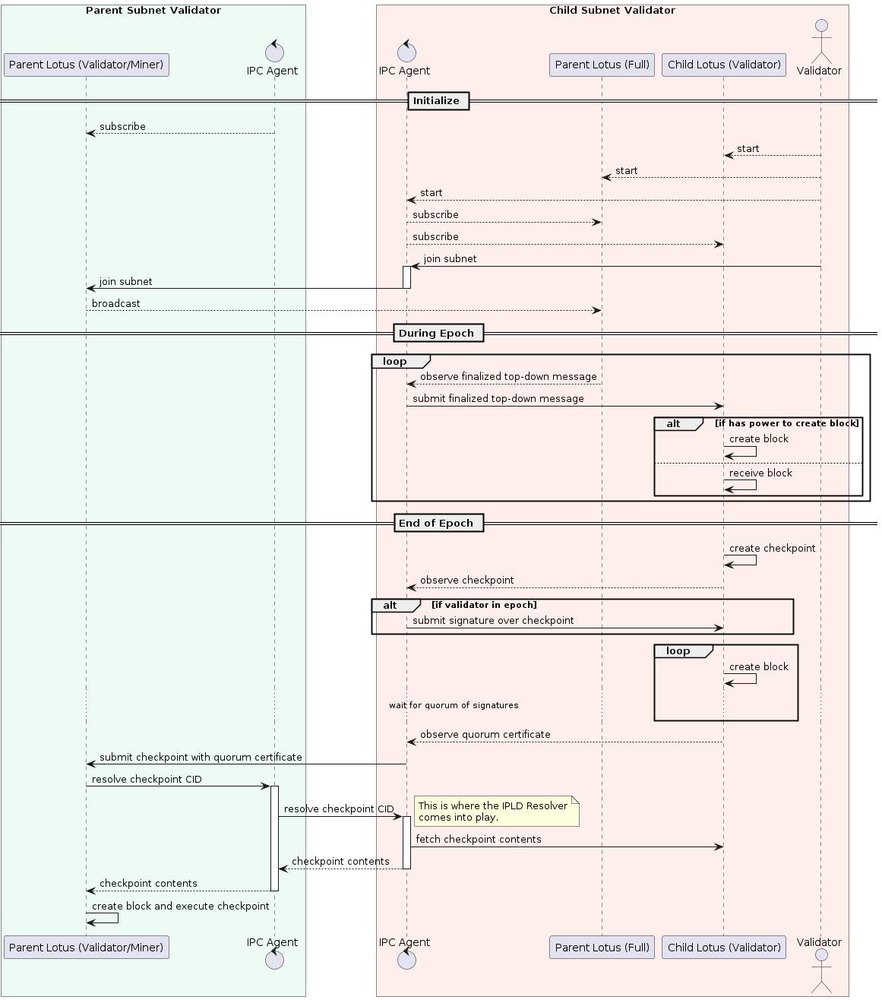

# IPC Agent

The IPC Agent is a process faciliting the participation of Filecoin clients like Lotus in the InterPlanetary Consensus (formerly Hierarchical Consensus).

Please refer to the [IPD Agent Design](https://docs.google.com/document/d/14lkRRv6MQYnuEfp2GoGngdD8Q5YgfE38D8HTZWKgKf4) document for details on the agent.

# IPLD Resolver

The [IPLD Resolver](../ipld/resolver) is a library that IPC Agents can use to exchange data between subnets in IPLD format.

## Checkpointing

The most typical use case would be the propagation of checkpoints from child subnets to the parent subnet.

### Checkpoint Schema

One possible conceptual model of checkpointing is depicted by the following Entity Relationship diagram:

It shows that the Subnet Actor in the parent subnet governs the power of validators in the child subnet, which is fixed a certain number of blocks, called an epoch.

At the end of an epoch, the validators in the child subnet produce a checkpoint over some contents, notably the bottom-up or cross-messages they want to propagate towards the parent subnet. Through the cross-messages, the checkpoint indirectly points to individual messages that users or actors wanted to send.

Once enough signatures are collected to form a Quorum Certificate over the checkpoint (the specific rules are in the jurisdiction of the Subnet Actor), the checkpoint is submitted to the parent ledger.

However, the submitted checkpoint does not contain the raw messages (indicated by the dashed line). The content needs to be resolved using the IPC Resolver.

### Checkpoint Submission and Resolution

The following sequence diagram shows one possible way how checkpoints can be submitted from the child to the parent subnet.

It depicts two validators: one only participating on the parent subnet, and the other on the child subnet; the latter has to also run at least a full node on the parent subnet. Both validators run one IPC AGent each.

The diagram shows that at the end of the epoch the child subnet validators produce a Quorum Certificate over the checkpoint, which some of their agents submit to the parent subnet.

After that, the parent subnet nodes reach out to their associated IPC Agent to resolve the checkpoint, which the Agent does by communicating with some of its child-subnet peers.

This is just a high level view of what happens during message resolution. In the next section we will delve deeper into the internals of the IPLD Resolver.

## IPLD Resolver Sub-components

TODO
