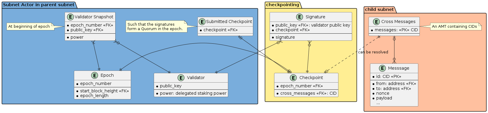

# IPC Agent

The IPC Agent is a process faciliting the participation of Filecoin clients like Lotus in the InterPlanetary Consensus (formerly Hierarchical Consensus).

Please refer to the [IPD Agent Design](https://docs.google.com/document/d/14lkRRv6MQYnuEfp2GoGngdD8Q5YgfE38D8HTZWKgKf4) document for details on the agent.

# IPLD Resolver

The [IPLD Resolver](../ipld/resolver) is a library that IPC Agents can use to exchange data between subnets in IPLD format.

## Checkpointing

The most typical use case would be the propagation of checkpoints from child subnets to the parent subnet.

### Checkpoint Schema

One possible conceptual model of checkpointing is depicted by the following Entity Relationship diagram:

It shows that the Subnet Actor in the parent subnet governs the power of validators in the child subnet, which is fixed a certain number of blocks, called an epoch.

At the end of an epoch, the validators in the child subnet produce a checkpoint over some contents, notably the bottom-up or cross-messages they want to propagate towards the parent subnet. Through the cross-messages, the checkpoint indirectly points to individual messages that users or actors wanted to send.

Once enough signatures are collected to form a Quorum Certificate over the checkpoint (the specific rules are in the jurisdiction of the Subnet Actor), the checkpoint is submitted to the parent ledger.

However, the submitted checkpoint does not contain the raw messages (indicated by the dashed line). The content needs to be resolved using the IPC Resolver.

### Checkpoint Workflow

The following sequence diagram shows one possible way how checkpoints can be submitted from the child to the parent subnet.

TODO: Checkpoint Submission Sequence

1. There are Lotus nodes running on parent subnet `P`. Every node can be associated with an IPC Agent process as well.
2. Some validators are also running nodes on child subnet `C`. The IPC Agents of these validators are connected to both nodes of the validator, the one running on `P` as well as the one running on `C`.
3. A checkpoint is prepared on `C` and it's submitted to `P`; see the [IPD Agent Design](https://docs.google.com/document/d/14lkRRv6MQYnuEfp2GoGngdD8Q5YgfE38D8HTZWKgKf4) on how this happens.
4. The checkpoint appears in the ledger of `P`. The checkpoint could comprise of a Quorum Certificate and the CID of its contents, but _not_ the content itself.
5. The nodes on `P` requires the contents of the checkpoint, so that they can apply the transactions in the checkpoint to the ledger. For this, they reach out to their associated IPC Agents and ask for the contents pointed to by the CID to be resolved. This is where the IPLD Resolver comes in.

### Checkpoint Content Resolution

TODO: Checkpoint Resolution Sequence

All IPC Agents using the IPLD Resolver library are be part of a Peer-to-Peer network, where they publish information about which subnets they can provide data for. The Agents on `C` would publish that they can provide data for `P` and `C` (since we expect every validator on `C` to also run a full node on `P`), while the Agents of validators participating exclusively in `P` would only declare support for `P`.

The very high level rundown of the resolution would go as follows:

1. Start an Agent, which runs the embedded IPLD Resolver.
2. Tell the Resolver which subnets are supported by the Agent, based on the configuration.
3. Discover other Resolvers on the network and learn which subnets they provide data for.
4. A Lotus node running on `P` sends a request to its Agent `A` to resolve CID `K` from subnet `C`. The request is passed on to the Resolver library.
5. Resolver `A` consults its Discovery module, looking for Resolvers providing data for subnet `C`.
6. Resolver `A` contacts some of the providers to pull the contents of `K`.
7. Once available, Agent `A` responds to Lotus.

In the following sections, we'll go deeper into how the IPLD Resolver works.
